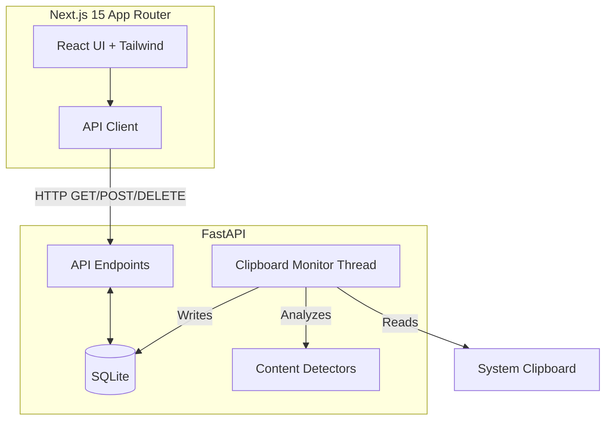

# PasteLens 🔍

PasteLens is an intelligent clipboard history manager for developers. Unlike traditional clipboard managers, it automatically classifies copied content (URLs, JSON, Secrets, Code, SQL, etc.) and makes it searchable.


## Features

- **Automatic Classification**: Detects URLs, Emails, JSON, SQL Queries, Source Code, JWTs, API Keys, UUIDs, and more.
- **Privacy First**: Sensitive content (passwords, API keys, JWT tokens) is automatically redacted in the UI with a "Reveal" button.
- **Smart Filtering**: Filter by type (All, URLs, Code, JSON, SQL, Secrets) and pin your favorites.
- **Timeline View**: Automatically groups your clipboard history by Today, Yesterday, and Older.
- **Modern UI**: Beautiful, responsive, dark-mode native UI built with Next.js and shadcn/ui.

## Architecture

PasteLens is built using a modern full-stack architecture:



## Project Structure

```text
pastelens/
├── backend/
│   ├── app/
│   │   ├── api/          # FastAPI router endpoints
│   │   ├── clipboard/    # Clipboard monitor thread
│   │   ├── database/     # SQLite configuration & session
│   │   ├── detectors/    # Pluggable content detectors
│   │   ├── models/       # SQLAlchemy ORM models
│   │   ├── schemas/      # Pydantic validation schemas
│   │   └── services/     # Business logic & DB operations
│   ├── Dockerfile
│   └── requirements.txt
├── frontend/
│   ├── src/
│   │   ├── app/          # Next.js 15 App Router pages
│   │   ├── components/   # UI & shadcn components
│   │   ├── hooks/        # React hooks
│   │   └── lib/          # Utilities and API client
│   ├── Dockerfile
│   └── next.config.ts
└── docker-compose.yml
```

## Setup & Installation

### Option 1: Docker (Recommended)

To run PasteLens using Docker, you need `docker` and `docker-compose` installed. Note that running in Docker uses `xvfb` to simulate a display for the clipboard monitor, but it will not have access to your host machine's clipboard. Docker is primarily for testing the API/UI.

```bash
docker-compose up --build
```
The app will be available at `http://localhost:3000`.

### Option 2: Local Development

To monitor your local host clipboard, run the backend locally.

**1. Backend**
```bash
cd backend
python -m venv venv
source venv/bin/activate  # On Windows: venv\Scripts\activate
pip install -r requirements.txt
uvicorn app.main:app --reload --port 8000
```

**2. Frontend**
```bash
cd frontend
npm install
npm run dev
```

The app will be available at `http://localhost:3000`.

## API Documentation

When the backend is running, you can view the interactive OpenAPI documentation at:
- Swagger UI: `http://localhost:8000/docs`
- ReDoc: `http://localhost:8000/redoc`

### Core Endpoints

- `GET /api/v1/history` - Fetch clipboard history (supports pagination and filtering).
- `POST /api/v1/clipboard` - Manually add a clipboard entry.
- `DELETE /api/v1/clipboard/{id}` - Delete a specific entry.
- `DELETE /api/v1/history` - Clear all history (excluding pinned items).
- `PUT /api/v1/clipboard/{id}/pin` - Toggle the pinned status of an entry.

## Future Roadmap

- 🤖 **AI Integration**: Summarization, auto-tagging, and semantic search using local LLMs.
- 🖼️ **Image Support**: Monitor and save copied images.
- 💻 **Desktop App**: Package as a Tauri desktop application for native global keyboard shortcuts.
